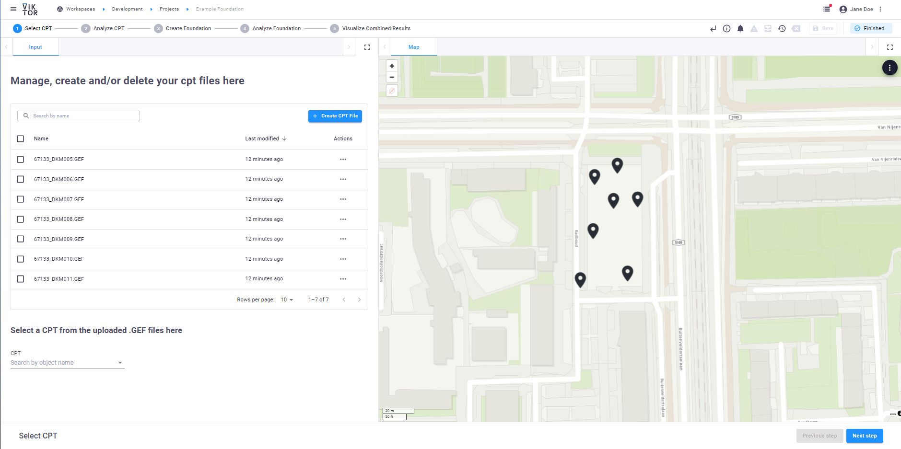
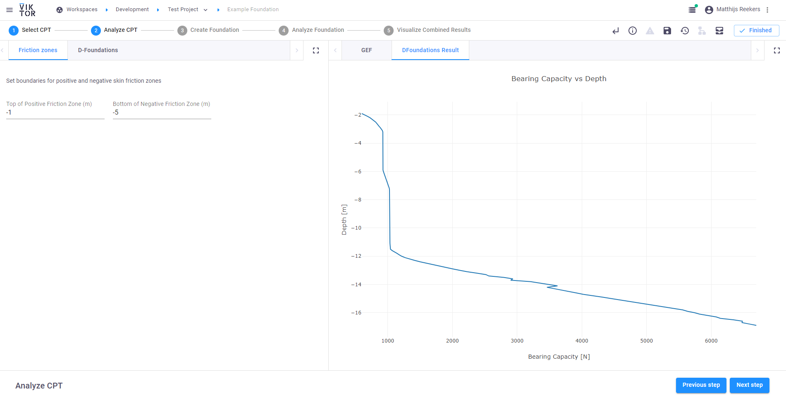
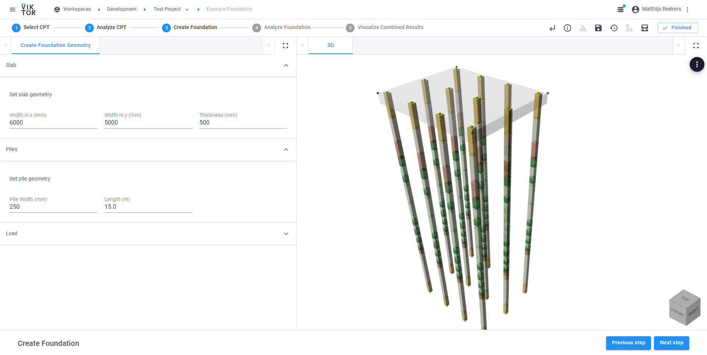

 <Please check version is the same as specified in requirements.txt>

# Pile Foundations
This sample app demonstrates the ability to analyze the performance of a pile foundation when implemented at a particular CPT. <basic one line intro here>

The process of analysing pile foundations consists of 5 steps.  


1. Select CPT: The available CPTs are visible in the MapView.  


2. Analyse CPT: The soil layout can be visualized in the GEF-tab. Next, the CPT can be analysed in the D-Foundations-tab, where the bearing capacity is obtained with respect to the depth of the CPT. 



3. Create a foundation: Here, a foundation geometry with an applied load can be created and visualized. The colour of the foundation is linked to the soil layout of the selected CPT in step 1. 



4. Analyse foundation: In the SCIA result-tab, an analysis in SCIA is called to find the maximum reaction forces allowed to act on a single pile. 


5. Visualize combined results: The results from the D-Foundations- and SCIA-analyses can be combined to plot a required pile tip level for the defined foundation at the selected CPT location. The user can choose to go back to step 3 to re-analyse the foundation with a different pile length based on this result.  


  
To run this code, you will need a VIKTOR licence, which you can access using our [free version](https://www.viktor.ai/try-for-free). You will need your own D-Foundations and SCIA licences for the integration. 

## App structure <please provide if more than a single entity type is present>

```
project_folder: has projects as its children
  └─ project: has cpt files and foundations as its children
     └── cpt_file: intrepretation of a CPT file using the Robertson method  
     └── foundation: can show cpt_files on a map, can determine bearing capacity of the soil and determine reaction force of the foundation piles
```